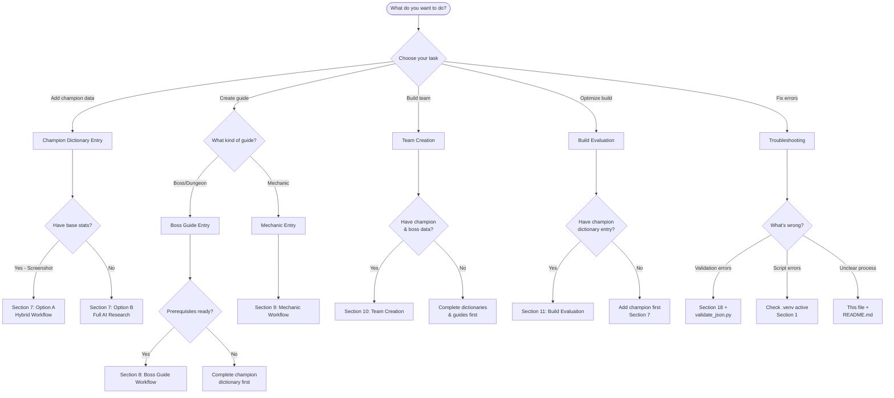

# Raid Tools: AI Agent Instructions

## Table of Contents

1. [Quick Start Summary](#1-quick-start-summary)
2. [Best Practices](#2-best-practices)
3. [Project Purpose and Scope](#3-project-purpose-and-scope)
4. [User Content Priorities and Focus](#4-user-content-priorities-and-focus)
5. [Authoritative Data Sources](#5-authoritative-data-sources)
6. [Templates and Examples](#6-templates-and-examples)
7. [Champion Dictionary Entry Workflow](#7-champion-dictionary-entry-workflow)
8. [Boss Guide Entry Workflow](#8-boss-guide-entry-workflow)
9. [Mechanic Entry Workflow](#9-mechanic-entry-workflow)
10. [Team Creation and Analysis Workflow](#10-team-creation-and-analysis-workflow)
11. [Build Evaluation and Optimization](#11-build-evaluation-and-optimization)
12. [Validation and Documentation Standards](#12-validation-and-documentation-standards)
13. [Guide Update and Versioning Policy](#13-guide-update-and-versioning-policy)
14. [Continuous Improvement Policy](#14-continuous-improvement-policy)
15. [Review Questions and Feedback](#15-review-questions-and-feedback)
16. [Housekeeping Shift-Left and Proactive Maintenance](#16-housekeeping-shift-left-and-proactive-maintenance)
17. [Glossary](#17-glossary)
18. [Troubleshooting and Maintenance](#18-troubleshooting-and-maintenance)
19. [Change Log and Version History](#19-change-log-and-version-history)

---

## 1. Quick Start Summary

### Champion Dictionary Canonical Source Policy

- The file `input/Templates/Champion_Dictionary_Template.json` is the **only** canonical template for all champion dictionary entries.
- All new or updated champion entries in `input/Champion_Dictionary/` must strictly follow this template's structure and field names.
- Do not copy, modify, or reference outdated templates elsewhere—always use the latest version of this file.
- When updating the template, immediately update the schema (`Champion_Dictionary_Schema.json`) and communicate changes to all contributors.
- All validation, automation, and guide generation scripts must reference this template for field definitions and required structure.
- Before submitting or merging any champion entry, validate it against the template and schema using `Tools/validate_json.py --schema`.
- If a field or structure is missing from the template, propose an update to the canonical template before using it in any entry.

### Project Overview

Raid Tools is an automation-ready system for generating, validating, and maintaining RAID Shadow Legends boss guides, champion/team dictionaries, and meta analysis. The codebase is structured for modular intake, analysis, and output, with all major workflows and templates standardized for automation and onboarding.

**Key architectural concepts:**
- **Dictionary-driven:** All champion, boss, mechanic, and team data is stored as individual JSON/Markdown files in canonical directories for automated parsing and guide generation.
- **Workflow modularity:** Each major operation (intake, analysis, summary, validation) is a standalone Python script, with VS Code tasks and Makefile targets for orchestration.
- **Template-first:** All new entries must use the templates in `input/Templates/` (see below for mapping).
- **Strict directory conventions:** All intake is under `input/`, all outputs under `Output/`, with enforced naming for automation.

### Directory Structure & Key Files

| Entry Type         | Directory                        | Template File                                    | Notes |
|--------------------|----------------------------------|--------------------------------------------------|--------|
| Champion           | input/Champion_Dictionary/       | input/Templates/Champion_Dictionary_Template.json | Completed champion JSON files |
| Champion Intake    | input/Champion_Intake_list.md    | N/A                                              | Queue of champions to process |
| Stats Table        | input/Champion_Dictionary/Champion_stats.md | N/A                               | Reference table with Owned column (auto-updated by scraper) |
| Mechanic           | input/Mechanic_Dictionary/       | input/Templates/Mechanic_Entry_Template.json      | Mechanic reference files |
| Boss Guide         | Output/Boss_Guides/              | input/Templates/Boss_Guide_Template.md            | Generated boss guides |
| Team               | Output/Build_Evaluations/        | input/Templates/Team_Entry_Template.md            | Team compositions |
| Build Evaluation   | Output/Build_Evaluations/        | input/Templates/Build_Evaluation_Template.md       | Build analysis |

**All new entries must use the canonical template.**

### Critical Workflows

**Environment setup:**
- Run `python Tools/Setup_Environment.py` or `make setup` to create `.venv` and install requirements.
- Activate the virtual environment before running scripts.

**Core operations:**
- Use VS Code tasks (Ctrl+Shift+P → "Tasks: Run Task") or command line for:
	- **Champion intake (4-source validation):** `python Tools/champion_scraper/champion_scraper.py "Name" --owned 1`
		- Scrapes Fandom table → Ayumilove (OCR) → HellHades → Validates stats
		- Auto-updates `Champion_stats.md` table with validated data
		- `--owned N` updates Owned column in Champion_stats.md table
		- Creates JSON in `input/Champion_Dictionary/`
	- **Batch intake:** `python Tools/champion_scraper/champion_scraper.py --list input/Champion_Intake_list.md`
		- Processes all champions in the intake queue
		- Auto-updates stats table and creates JSON entries
		- Remove champions from intake list after processing
	- **Table sync:** `python Tools/champion_scraper/scripts/sync_table_from_json.py`
		- Syncs `Champion_stats.md` with all JSON files in Champion_Dictionary/
	- **Validate JSON:** `python Tools/Validate/validate_json.py --schema` or `make validate`

**Two-File Workflow:**
1. **Champion_Intake_list.md** - Work queue for champions to process
   - Add champion names (one per line)
   - Run scraper with `--list` flag
   - Remove names after successful processing
2. **Champion_stats.md** - Comprehensive reference table (auto-updated)
   - Contains all champions with base stats
   - Owned column tracks ownership counts
   - Auto-updated by scraper - never edit manually

**Validation:**
- All champion/boss/mechanic/team entries must be validated against at least two authoritative sources (Ayumilove, HellHades, RaidHQ, in-game testing).
- Use `jsonschema` for schema validation of champion JSONs.

**Versioning:**
- Use DRAFT-to-FINAL workflow for all major guide and dictionary updates. Never overwrite FINAL files directly; always promote from DRAFT after review.
- Archive old versions with date-stamped filenames if needed.

### Project-Specific Conventions

- All directory and file names use underscores for automation.
- No root-level entries; always use `input/` or `Output/`.
- All entries must be modular, indexable, and cross-referenced.
- Cheese/meta teams must be tagged in both team and boss guide entries.
- All validation steps, sources, and simulation results must be documented in each entry.

### Integration & Automation

- All scripts are Python 3.10+ and expect the `.venv` environment.
- Use Makefile or VS Code tasks for all core workflows; do not run scripts ad hoc unless debugging.
- All new or updated templates must be referenced in this file and included in `input/Templates/`.

### Example: Adding a New Champion

1. Place a new JSON file in `input/Champion_Dictionary/` using the canonical template.
2. Validate with at least two sources and run `python Tools/validate_json.py`.
3. Document sources and validation in the entry.
4. Use DRAFT-to-FINAL workflow for major changes.

### Decision Tree: What Should I Do First?



### Quick Troubleshooting

- If validation fails, check for duplicate keys, missing fields, or schema mismatches.
- If automation scripts break, ensure the `.venv` is active and requirements are installed.
- For unclear workflows, see this file and `README.md` for canonical process.

### See Also

- `README.md` for onboarding and quick start
- `input/Templates/` for all templates
- This file for all project-specific conventions and workflows

### Directory Structure and Drop Points

All major entry types and templates are stored in standardized directories for automation and onboarding. Use these exact paths for all intake, output, and reference operations:

| Entry Type                | Directory Path (relative to repo root)                | Format/Notes                                  |
|--------------------------|------------------------------------------------------|------------------------------------------------|
| Champion Dictionary      | input/Champion_Dictionary/                           | JSON, one file per champion                   |
| Mechanic Dictionary      | input/Mechanic_Dictionary/                           | JSON, one file per mechanic (input, WIP)      |
| Templates                | input/Templates/                                     | Markdown/JSON templates for all entry types    |
| Prompts                  | input/Prompts/                                       | Markdown prompt files for automation           |
| Boss Guides              | Output/Boss_Guides/                                  | Markdown, one file per boss/guide              |
| Build Evaluations        | Output/Build_Evaluations/                            | Markdown/JSON, one file per build (output)     |
| Mechanic Dictionary (Out)| Output/Mechanic_Dictionary/                          | JSON, one file per mechanic (output, WIP)      |

**Notes:**
- All directory names use underscores for consistency and automation.
- All paths are relative to the root of the repository (`c:\GIT\Raid_Tools`).
- Do not create or use root-level directories for entries; always use the `input/` or `Output/` folders as shown.
- Templates and prompts are always in `input/`.
- Output files (guides, evaluations) are always in `Output/`.

### Example Usage

- To add a new champion entry: place the JSON file in `input/Champion_Dictionary/`.
- To add a new boss guide: place the Markdown file in `Output/Boss_Guides/`.
- To update a mechanic: use `input/Mechanic_Dictionary/` for intake, `Output/Mechanic_Dictionary/` for output.
- To find templates: look in `input/Templates/`.

| Task | Where to Start |
|------|----------------|
| Add a champion | input/Champion_Dictionary_Prompt_template.md |
| Add a boss guide | input/Boss_Guide_Template.md |
| Add a mechanic | input/Champion_Dictionary_Prompt_template.md (mechanics section) |
| Add a team | See team template in instructions, [Section 6: Templates and Examples](#6-templates-and-examples) |
| Validate or update | See [Validation & Documentation Standards](#12-validation-and-documentation-standards) |
| Review/feedback | Use chat and update prompt files as needed |

---

## 2. Best Practices

### ✅ DO

- **Document workflows step-by-step** - Copilot can follow processes
- **Include examples** - show Copilot what "good" looks like
- **Update regularly** - as project evolves, update instructions
- **Reference external sources** - link to docs, APIs, wikis
- **Define quality gates** - give Copilot clear success criteria

### Commit Best Practices

- After completing a logical chunk of work (such as a batch of file updates, a major template/schema change, or a successful validation/refactor), make a git commit with a clear, descriptive message.
- Periodically suggest or perform commits during long or multi-step workflows to ensure changes are tracked and can be easily reverted if needed.
- Include validation results, sources, and a summary of changes in the commit message when possible.
- Use the DRAFT-to-FINAL workflow for major guide and dictionary updates, but commit intermediate DRAFTs as work progresses.

### ❌ DON'T

- **Don't duplicate base instructions** - reference, don't repeat
- **Don't use vague language** - be specific and actionable
- **Don't forget to update** - stale instructions confuse Copilot
- **Don't over-constrain** - leave room for Copilot to be creative
- **Don't ignore edge cases** - document unusual scenarios
- **Don't skip the questionnaire** - comprehensive initialization prevents issues

---

## 3. Project Purpose and Scope

The goal of this project is to create a comprehensive, automation-ready dictionary of RAID Shadow Legends content, focused on the user's actual owned champions, teams, and mechanics.

The project supports:
- Creating JSON dictionary entries for every owned champion, using the canonical process in `Champion_Dictionary_Prompt_template.md`.
- Creating similar entries for all bosses (with Hard difficulty focus if available), documenting mechanics, stat requirements, and all relevant trials.
- Adding/updating mechanic entries (buffs, debuffs, passives, unique effects) as needed for indexing and team-building.
- Enabling automated team creation, mechanic mapping, and testing using champion and mechanic entries.
- Building teams for each boss and mechanic, including meta, cheese, and hybrid teams, with analysis of damage, gearing, speed tunes, alternates, and ideal pulls (unowned champions).
- Advising on best team archetypes for each boss/dungeon (e.g., HP Burn, Poison, raw damage, buff spread).
- Inputting and evaluating actual champion builds/setups for effectiveness in their best use case, recommending upgrades, speed tunes, and new team compositions based on current builds and meta.
- Generating actionable boss guides and team notes using current builds, with recommendations for improvement.
- Focusing on maximizing damage (Clan Boss), reliability/clear speed (dungeons/bosses), and Faction Wars progression.
- Recommending new speed tunes and strategies as the meta evolves, and supporting continuous learning as new content and mechanics are released.

---

## 4. User Content Priorities and Focus

### Content Priority Order (Always Follow)

**Priority 1: Clan Boss UNM**
- Highest priority for all champion ratings, team recommendations, and guide updates
- User has UNM-capable clan (daily rewards secured)
- Focus on damage optimization, unkillable teams, and cheese strategies

**Priority 2: Dungeons (All Stages 25)**
- Dragon, Spider, Fire Knight, Ice Golem
- User preference: HP Burn teams (well-built), Poison teams (NOT well-built)
- Spider team confirmed strong

**Priority 3: Advanced PVE Content**
- Doom Tower Hard (boss-specific strategies)
- Cursed City and other advanced PVE encounters
- Iron Twins Fortress, Chimera, Hydra

**Priority 4: Arena**
- Classic Arena (Gold 3+)
- Tag Team Arena (Bronze 3+, lower priority than Classic)
- Live Arena (basic coverage, user still developing strategy)

**Priority 5: Faction Wars**
- **Completed Normal:** Orc, Banner Lords, Barbarian, Dwarf
- **Near Completion:** Lizardmen, Knights Revenant, High Elf, Dark Elf
- Priority: Complete remaining Normal stages, then progress to Hard

### Champion Use Case Documentation

**When documenting champions, always highlight:**
- Specific boss/dungeon applications
- Unique mechanics or cheese strategies
- Wave clear capabilities (general or content-specific)
- Role in Faction Wars (for user's in-progress factions)

### User Team Composition Preferences

**Core Arena Team (Classic):**
- **Wukong** (speed lead, buff strip, nuke, sheep control)
- **Mythrala** (buffs/cleanse, hex damage)
- **Loki** (control, buff strip, suppress mythics/active skills)
- **Flex spot:** Ninja, Michelangelo, Coldheart, Godseeker Aniri, Arbiter, Rector Drath

**Team Building Preferences:**
- HP Burn teams: Well-built and preferred
- Poison teams: Not well-built (Frozen Banshee, Elenaril, Narma weak)
- Speed tuning: Often loses speed battle in higher Arena tiers
- Cheese strategies: Prioritize SAFE cheese builds for bosses and Clan Boss

---

## 5. Authoritative Data Sources

### Validation Rules
- All champion, boss, mechanic, and team data must be validated from at least two authoritative sources before entry creation or update.
- Stats may be pulled from screenshots of the champions base stats. If unsure, confirm in chat.

### Primary Sources
- **Ayumilove**: Champion guides, skill descriptions, gear/mastery recommendations. (https://ayumilove.net/raid-shadow-legends-guide/)
- **HellHades**: Team compositions, speed tuning, tier lists, champion ratings. (https://hellhades.com/)
- **RaidWiki**: Champion and boss data including stats in text, and mechanics. Missing many champions. (https://raid.wiki/)
- **In-Game Testing**: User-provided simulation results, screenshots, and direct observation.

### Source Documentation
- Always cite sources in each entry and in commit messages.

---

## 6. Templates and Examples

### Purpose
Provide canonical templates and example entries for all knowledge base types (champion, boss, mechanic, team, build) to ensure consistency, automation, and ease of use.

**Storage Location:**
All champion dictionary entries are stored as individual JSON files in the `Champion Dictionary` directory at the root of the repository. Each file is named after the champion (e.g., `Abbess.json`).

### Template Documentation
- For each entry type, document or specify the canonical template (JSON or Markdown) in the instructions.
- If a template or example does not exist, mark as WIP and add it to the project as you progress.
- All new or updated templates should be referenced in the instructions and included in the repo for future automation and consistency.

### Champion Dictionary Template (JSON)
See `input/Champion_Dictionary_Template.json` for the canonical champion dictionary entry template. This file provides the required structure and field documentation for all champion entries. Do not specify the JSON syntax in multiple places—always reference this template for champion dictionary entry format.

### Boss Guide Template (Markdown)
See `input/Boss_Guide_Template.md` for the full canonical template. Include anchors. Key sections:
- Table of Contents (anchor-linked)
- Boss Mechanics & Stat Requirements
- Trial/Mechanic Mapping
- Quick Reference Tables
- Detailed Team Recommendations
- Best Champions & Team Participation
- Champion Comparisons
- Ideal Champions to Pull
- General Notes
- Actionable Advice
- Validation & Simulation Notes

### Mechanic Entry Template (JSON/Markdown) DRAFT
```json
{
	"name": "Mechanic Name",
	"type": "buff/debuff/passive/unique",
	"description": "Mechanic effect description.",
	"affected": ["Champion A", "Champion B", ...],
	"interactions": ["Countered by X", "Synergizes with Y"],
	"validation_sources": ["Ayumilove", "HellHades"],
	"notes": "Any special notes or conflicts."
}
```

### Team Entry Template (Markdown/JSON) DRAFT
```markdown
| Team Name | Content | Difficulty | Champions | Alternates | Speed Tune | Gear | Masteries | Manual/Auto | Strengths | Weaknesses | Sim Results | Affinity Safety/Risk | Actionable Advice | Validation Sources |
|-----------|---------|------------|-----------|------------|------------|------|-----------|-------------|-----------|------------|-------------|----------------------|-------------------|-------------------|
| Example   | Clan Boss | UNM | [A, B, C, D, E] | [F, G] | 191/171/171/171/171 | Speed, Lifesteal | Warmaster | Auto | High damage | Needs books | 70M avg | Safe (all neutral) | Use A2 on turn 1 | Ayumilove, HH |
```

### Build Evaluation Template (Markdown/JSON) DRAFT
```markdown
| Champion | Content | Current Build | Recommended Build | Gaps/Issues | Upgrade Priorities | Validation Sources |
|----------|---------|---------------|-------------------|-------------|--------------------|-------------------|
| Example  | Clan Boss | Speed+Lifesteal, 210 SPD, 220 ACC | Speed+Lifesteal, 220 SPD, 250 ACC | ACC low | 1. ACC 2. SPD | Ayumilove, HH |
```

---

## 7. Champion Dictionary Entry Workflow

> **SUMMARY:** Automated scraping (RaidWiki + Ayumilove) → Manual validation → Effects population → Meta research → Review. Hybrid workflow takes 2-3 minutes per champion. Always use canonical template and validate against at least two sources.

### Purpose
Establish a validated, canonical process for creating, updating, and maintaining champion dictionary entries in the RAID Shadow Legends knowledge base. This ensures all champion data is accurate, cross-referenced, and indexable for downstream guide and team generation.

### Canonical Template
- All champion entries must use the canonical template in `input/Champion_Dictionary_Prompt_template.md` (see file for full field list and mechanics tag index; if missing, mark as WIP and stage a placeholder).

### Prerequisites
Before starting a champion entry, ensure:
- [ ] Virtual environment `.venv` is activated
- [ ] `input/Templates/Champion_Dictionary_Template.json` is available and up-to-date
- [ ] Champion name is confirmed (exact spelling matters for scraper)
- [ ] At least two authoritative sources are accessible (RaidWiki, Ayumilove, HellHades)
- [ ] `Tools/validate_json.py` is available for validation

### Entry Creation Workflow
Follow the unified standards in Sections 12 (Validation and Documentation Standards) and 13 (Guide Update and Versioning Policy) for all entry creation, validation, documentation, and automation requirements. The canonical process is:
1. **Data Gathering**: Using the champion_scraper tool, scrape information for the input champion from authoritative sources (see [Section 5: Authoritative Data Sources](#5-authoritative-data-sources)).
  - Looks for a Raidwiki for base stats
  - Then scrapes ayumilove including OCR, for stats (validation if exist), skills, and champion info.
  - Passes this to a script to populate the json template.
2. **Validation**: Manual validation of all data per [Section 12 (Validation and Documentation Standards)](#12-validation-and-documentation-standards). If using LLM, note conflicts, uncertainties, and data confidence.
3. **Cleanup & Canonicalization**: After entry creation or refactor, run a cleanup/validation step to ensure the file contains no duplicate keys, repeated info, or structural errors. Confirm the file matches the canonical template and is valid JSON. This prevents issues like duplicate fields or merged blocks from automation or manual edits.
4. **Entry Review & Approval**: Present for review, then add to the dictionary. Update index/search tools as needed, including these instructions.

**COMMON MISTAKES:**
- **Using old champion entries as templates** → ALWAYS use `input/Templates/Champion_Dictionary_Template.json`
- **Skipping validation** → Run `Tools/validate_json.py --schema` before finalizing
- **Forgetting to update schema** → When adding new fields to template, update `Champion_Dictionary_Schema.json` immediately
- **Not documenting sources** → Always cite at least 2 authoritative sources in validation_metadata

### Champion Dictionary Entry Completion Process

**Standard Workflow: Option A (Hybrid - User Stats + AI Research)**

**Step 1: User Provides Base Stats**
- User provides screenshot of champion base stats
- AI validates and inputs stats into JSON

**Step 2: Skill Analysis & Effects Population**
- AI parses skill descriptions from scraped data
- For each skill, populate:
  - `effects[]`: Array of effect objects with type, stat, value, target, duration, notes
    - Parse damage multipliers and scaling stats
    - Document debuff/buff durations and conditions
    - Note special mechanics and interactions
  - `mechanics_tags[]`: Relevant tags (e.g., "HP Burn", "DEF scaling", "AOE")
  - `book_value`: Booking priority and impact summary
  - `notes`: Skill-specific strategy, synergies, and warnings
- Use multiple effect objects for multi-component skills

**Step 3: Clean Skill Descriptions**
- Remove extraneous information from `description` field:
  - ❌ Remove: Level-up details (e.g., "Level 2: Damage +5%")
  - ❌ Remove: Damage multipliers (e.g., "Damage Multiplier: 4 DEF")
  - ✅ Keep: Core skill functionality and mechanics
  - ✅ Keep: Base debuff/buff chances and durations
- All removed information is preserved in `effects[]`, `book_value`, and `notes`

**Step 4: Meta Research & Analysis**
- Search authoritative sources (HellHades, Ayumilove, RaidHQ)
- Populate:
  - `meta_ratings`: Content-specific ratings (1-10 scale)
  - `stat_priority_recommendations`: Content-specific stat targets
  - `recommended_gear`: Gear sets and stat priorities
  - `masteries`: Content-specific mastery trees. Reference the Masteries.md table under the Mechanics Dictionary
  - `blessings`: Best blessing choices
  - `mechanics_advisory`: Overall strategy and use cases
  - `cheese_strategy`: Cheese viability and synergies (if applicable)
  - `ai_quirks`: AI behavior notes

**Step 5: Cross-Reference with User Priorities**
- Align recommendations with user's content priorities:
  - Priority 1: Clan Boss UNM
  - Priority 2: Dungeons (HP Burn preference)
  - Priority 3: Advanced PVE (Doom Tower, etc.)
  - Priority 4: Arena
  - Priority 5: Faction Wars (check user's faction progress)
- Add user-specific notes in `comments` field

**Step 6: Validation & Documentation**
- Add `validation_metadata`:
  - `stat_confidence`: 100 (user screenshot)
  - `data_sources`: "user_screenshot"
  - `ocr_notes`: "Stats manually provided by user via screenshot - 100% accurate"
- Cite all sources in `citations[]`
- Set `author` and update `update_notes`
- Keep `draft: true` until user review

**Time Estimate: 2-3 minutes per champion**

### When NOT to Use Option A

- Use **Option B (Full AI Research)** if user cannot provide stats screenshot
- Use **Build Evaluation Workflow** ([Section 11: Build Evaluation and Optimization](#11-build-evaluation-and-optimization)) if optimizing existing champion builds
- Use **Team Building Workflow** ([Section 10: Team Creation and Analysis Workflow](#10-team-creation-and-analysis-workflow)) for roster-specific team recommendations

### Update & Maintenance Workflow
Follow the update, versioning, and documentation standards in [Section 13 (Guide Update and Versioning Policy)](#13-guide-update-and-versioning-policy) for all changes. Use DRAFT-to-FINAL workflow, versioning, and changelog documentation as described. Always run the cleanup/validation step after any major edit or refactor.

### Automation & Indexing

#### Cheese/Meta Teams
Add a dedicated section or tag for cheese/meta teams in all team and boss guide entries. Check for boss, champion, or mechanic-specific cheese teams based on owned champions. Reference these in both the main team workflow and a dedicated cheese/meta section.

All entries must be structured for automated parsing and indexing as described in Sections 12 (Validation and Documentation Standards) and 13 (Guide Update and Versioning Policy). Use consistent tags and field names. Always ensure files are cleaned and canonical before indexing.

**Cheese/Meta Mechanics:**
- **Defensive:** Unkillable, Block Damage, Ally Protection, Stoneskin, Shield Spam, Reflect Damage, Leech, Triple Revive Loop
- **Control:** TM Lock, Freeze Lock, Stun Lock, Provoke Chain, Sleep Lock
- **Offensive:** HP Burn, Poison, Poison Explosion, Ally Attack Spam, MAX HP Nuke, Triple [Champion] Stacking
- **Hybrid:** Buff Spread, Turn Meter Control, Counterattack, Continuous Heal Stacking
- Always tag in both champion entries AND boss guides

---

## 8. Boss Guide Entry Workflow

> **SUMMARY:** Research boss mechanics from 2+ sources → Map trials/mechanics to owned champions → Build/simulate 5-8 unique teams → Document in canonical template → Validate with 3+ test runs per team. Regenerate after roster changes.

### Purpose
Define a validated, modular process for creating, updating, and maintaining boss guide entries for RAID Shadow Legends. Ensure all guides are actionable, cross-referenced, and optimized for owned champion rosters and current meta.

### Canonical Template
- All boss guides must use the canonical template in `input/Boss_Guide_Template.md` (see file for full section list; if missing, mark as WIP and stage a placeholder).

### Prerequisites
Before starting a boss guide, ensure:
- [ ] At least two authoritative sources for boss mechanics are accessible
- [ ] Owned champion list is current and validated
- [ ] Champion dictionary entries for all owned champions are complete
- [ ] Template file `input/Boss_Guide_Template.md` is available
- [ ] Testing environment ready (ability to run 3-5 simulations per team)

### Guide Creation Workflow
Follow the unified standards in Sections 12 (Validation and Documentation Standards) and 13 (Guide Update and Versioning Policy) for all guide creation, validation, documentation, and automation requirements. The canonical process is:
1. **Research & Data Gathering**: Review and cross-validate boss data from authoritative sources (see [Section 5: Authoritative Data Sources](#5-authoritative-data-sources)). Document all sources.
2. **Trial/Mechanic Mapping**: Map all boss trials/mechanics to the owned champion list. Build per-trial and combo tables, noting affinity safety/risk and special notes.
3. **Team Building & Simulation**: Build and simulate 5–8 unique teams using only owned champions, maximizing trial/mechanic completion, damage, and hybrid approaches. For each team, specify all required details and run at least 3 simulations per team (see [Section 12: Validation and Documentation Standards](#12-validation-and-documentation-standards) for simulation standards).
4. **Guide Structure & Output**: Use the canonical template and modular ToC. Populate all required sections. Add quick reference tables as needed.
5. **Update & Validation**: After any roster change, re-run all mapping, team building, and simulation steps. Regenerate all tables and recommendations as needed. Use DRAFT-to-FINAL workflow and document all validation steps.

**COMMON MISTAKES:**
- **Building teams without owned champion validation** → Always verify champions are actually owned before adding to team recommendations
- **Skipping simulations** → Run at least 3 test runs per team; 5 for RNG-heavy content
- **Not documenting affinity risks** → Explicitly note weak affinity matchups and safety concerns
- **Forgetting to update after roster changes** → Regenerate entire guide when new champions acquired

### Update & Maintenance Workflow
Follow the update, versioning, and documentation standards in [Section 13 (Guide Update and Versioning Policy)](#13-guide-update-and-versioning-policy) for all changes. Use DRAFT-to-FINAL workflow, versioning, and changelog documentation as described.

### Automation & Indexing
All guides must be structured for automated parsing and indexing as described in Sections 12 (Validation and Documentation Standards) and 13 (Guide Update and Versioning Policy). Use consistent tags, anchors, and field names.

---

## 9. Mechanic Entry Workflow

### Purpose
Define a standardized process for documenting, updating, and maintaining mechanic entries (buffs, debuffs, passives, unique effects) in the RAID Shadow Legends knowledge base. Ensure all mechanics are indexable, cross-referenced, and usable for automation and team-building.

### Canonical Template
- All mechanic entries must use the mechanics tag index and field documentation in `input/Champion_Dictionary_Prompt_template.md` (see file for mechanics list and tag details; if missing, mark as WIP and stage a placeholder). If a standalone mechanic template is needed, create and reference it here.

### Entry Creation Workflow
Follow the unified standards in Sections 12 (Validation and Documentation Standards) and 13 (Guide Update and Versioning Policy) for all entry creation, validation, documentation, and automation requirements. The canonical process is:
1. **Data Gathering**: Collect and cross-validate mechanic data from authoritative sources (see [Section 5: Authoritative Data Sources](#5-authoritative-data-sources)). Document all sources.
2. **Template Population**: Populate all required fields in the canonical template. Link to all affected champions, bosses, and teams. Specify known counters and unique interactions.
3. **Validation**: Validate all data per [Section 12 (Validation and Documentation Standards)](#12-validation-and-documentation-standards). Note conflicts, uncertainties, and data confidence.
4. **Entry Review & Approval**: Present for review, then add to the mechanic dictionary. Update index/search tools as needed.

### Update & Maintenance Workflow
Follow the update, versioning, and documentation standards in [Section 13 (Guide Update and Versioning Policy)](#13-guide-update-and-versioning-policy) for all changes. Use DRAFT-to-FINAL workflow, versioning, and changelog documentation as described.

### Automation & Indexing
All entries must be structured for automated parsing and indexing as described in Sections 12 (Validation and Documentation Standards) and 13 (Guide Update and Versioning Policy). Use consistent tags and field names.

### Core Summary of Info to Index
- Boss mechanics
- Game mechanic index/dictionary
- Interaction guidelines
- Passive mechanics
- Meta interactions and setups
- HP Burn and Poison and other damage based on Boss or Max HP mechanics
- 'Cheese' teams and mechanics ex unkillable, revive on death, block damage, poison explosion, etc

---

## 10. Team Creation and Analysis Workflow

### Purpose
Define a systematic, validated process for building, simulating, and analyzing teams for all RAID content (bosses, dungeons, Faction Wars, Arena, etc.), using only owned champions and validated mechanics. Ensure all teams are actionable, optimized, and documented for both manual and auto play.

### Canonical Template
- All team entries must use the standard template in [Section 6](#6-templates-and-examples) (see file for example; if a dedicated team prompt file exists, reference it here; if missing, mark as WIP and stage a placeholder).

### Prerequisites
Before starting team creation, ensure:
- [ ] Target content/boss is identified with mechanics documented
- [ ] Owned champion list is current and complete
- [ ] Champion dictionary entries for owned champions are available
- [ ] Boss/mechanic entries for target content are complete
- [ ] Testing environment ready for 3-5 simulation runs per team

### Team Creation Workflow
Follow the unified standards in Sections 12 (Validation and Documentation Standards) and 13 (Guide Update and Versioning Policy) for all team creation, validation, documentation, and automation requirements. The canonical process is:
1. **Team Archetype Selection**: Identify required mechanics/trials for the target content (see boss/mechanic entries). Select team archetypes based on owned champions and content requirements.
2. **Team Building**: Build 5–8 unique teams using only owned champions, maximizing trial/mechanic completion, damage, and hybrid approaches. For each team, specify all required details per the canonical template. Ensure all teams are unique unless cheese/duplicate strategies are explicitly allowed.
3. **Simulation & Validation**: Run at least 3 test runs per team (manual and/or auto as appropriate). If results are highly variable (RNG, new bosses, cheese teams), run up to 5. Rerun simulations if speed tunes or team comps change. Document results per [Section 12 (Validation and Documentation Standards)](#12-validation-and-documentation-standards).
4. **Documentation & Output**: Populate all required fields in the team template. Add quick reference tables and detailed team sections to the relevant boss/guide entry. Link to all referenced champion and mechanic entries.

### Update & Maintenance Workflow
Follow the update, versioning, and documentation standards in [Section 13 (Guide Update and Versioning Policy)](#13-guide-update-and-versioning-policy) for all changes. Use DRAFT-to-FINAL workflow, versioning, and changelog documentation as described.

### Automation & Indexing
All teams must be structured for automated parsing and indexing as described in Sections 12 (Validation and Documentation Standards) and 13 (Guide Update and Versioning Policy). Use consistent tags and field names.

---

## 11. Build Evaluation and Optimization

### Purpose
Provide a structured workflow for evaluating, optimizing, and documenting actual user champion builds for all RAID content. Ensure feedback is actionable, content-specific, and supports continuous improvement of the owned roster.

### Canonical Template
- All build evaluations must use a standard template specifying: Champion Name, Content Type, Current Build (gear sets, stats, masteries, skill books), Recommended Build (gear sets, stats, masteries, skill books), Gaps/Issues, Upgrade Priorities, and Validation Sources.
- Include a comparison table of current vs. recommended stats and gear.
- Link to relevant champion, team, and boss entries.

### Prerequisites
Before starting a build evaluation, ensure:
- [ ] Champion dictionary entry for the champion exists and is current
- [ ] Complete current build information is available (gear, stats, masteries, books)
- [ ] Target content/use case is clearly defined
- [ ] Recommended builds from authoritative sources are accessible
- [ ] Comparison criteria are established (stat thresholds, gear sets, etc.)

### Build Evaluation Workflow
Follow the unified standards in Sections 12 (Validation and Documentation Standards) and 13 (Guide Update and Versioning Policy) for all build evaluation, validation, documentation, and automation requirements. The canonical process is:
1. **Input Collection**: Gather current build details and specify primary content use.
2. **Comparison & Analysis**: Compare current build to recommended build for the target content. Identify gaps and note if the build is optimal, suboptimal, or misaligned.
3. **Upgrade & Optimization Advice**: Prioritize upgrades and suggest changes as needed. Recommend respec if appropriate.
4. **Documentation & Output**: Populate all required fields in the build evaluation template. Add actionable notes and upgrade path to the relevant champion/team entry. Link to referenced guides and validation sources.

### Update & Maintenance Workflow
Follow the update, versioning, and documentation standards in [Section 13 (Guide Update and Versioning Policy)](#13-guide-update-and-versioning-policy) for all changes. Use DRAFT-to-FINAL workflow, versioning, and changelog documentation as described.

### Automation & Indexing
All evaluations must be structured for automated parsing and indexing as described in Sections 12 (Validation and Documentation Standards) and 13 (Guide Update and Versioning Policy). Use consistent tags and field names.

---

## 12. Validation and Documentation Standards

> **SUMMARY:** All entries require 2+ authoritative sources. In-game testing takes priority. Document all validation steps, simulation results (5 runs, drop 1 outlier), and conflicts. Mark confidence levels when sources disagree.

### Purpose
Define rigorous standards for validating, documenting, and cross-referencing all knowledge base entries (champion, boss, mechanic, team, build) to ensure accuracy, transparency, and reproducibility.

### Validation Standards
- All entries must be validated with at least two authoritative sources (Ayumilove, HellHades, RaidHQ, in-game testing).
- In-game testing and user-provided screenshots take highest priority for stat and mechanic validation.
- If sources conflict, note the discrepancy and prefer community consensus (RaidHQ + Ayumilove/HellHades).
- Mark data confidence level (High/Medium/Low) if sources disagree or data is ambiguous.

### Documentation Standards
- Cite all sources in each entry and in commit messages.
- Document all validation steps, simulation results, and assumptions in a dedicated section of each entry.
- Note any uncertainties, conflicts, or alternate interpretations.
- Use clear, modular sectioning and field delimiters for automated parsing.

### Simulation & Testing
- For teams and builds, run at least 5 test runs (manual and/or auto as appropriate) and document results. Drop the most extreme outlier and use the remaining 4 for validation. Valid results should be similar, with no major outliers or swings.
- Note clear times, damage scores, trial completion, success rates, and affinity safety/risk.
- Use calculators or community tools for additional validation as needed.

### Cross-Referencing & Indexing
- Link all entries to relevant champions, bosses, mechanics, and teams.
- Update indexes and cross-references after each major addition or update.
- Use consistent tags and field names for search and automation.

**COMMON MISTAKES:**
- **Trusting single sources** → Always cross-validate with at least 2 authoritative sources
- **Not running enough simulations** → 5 runs minimum, drop 1 outlier, use remaining 4
- **Ignoring affinity differences** → Test all relevant affinities; note which are safe/risky
- **Skipping documentation** → Document validation steps IN the entry, not just mentally

---

## 13. Guide Update and Versioning Policy

> **SUMMARY:** DRAFT-to-FINAL workflow mandatory. Never overwrite FINAL files. Create DRAFT → validate → review → archive old FINAL → promote DRAFT. Use git for version control. Document all changes in commit messages.

### Purpose
Establish clear policies and workflows for updating, versioning, and maintaining all knowledge base entries (champion, boss, mechanic, team, build) to ensure accuracy, traceability, and reproducibility.

### Update Workflow
1. **Trigger for Update**
	- New champion acquired, champion/boss/mechanic reworked, or new content/mechanics released.
	- User requests update or identifies outdated information.
2. **Staging & Drafting**
	- Create a DRAFT version of the entry (e.g., `GuideName_DRAFT.md`).
	- Make all edits and additions in the DRAFT file, preserving the original FINAL version.
	- Stage detailed prompt files in input to describe listed workflows in more detail, including template info.
3. **Validation & Review**
	- Run validation scripts and cross-check with authoritative sources.
	- Present DRAFT for user or peer review.
	- Iterate as needed until approved.
4. **Promotion to FINAL**
	- After approval, archive the old FINAL version (e.g., `GuideName_OLD_YYYY-MM-DD.md`).
	- Rename DRAFT to FINAL (e.g., `GuideName_FINAL.md`).
	- Move archived files to an `Archive/` folder if desired.
5. **Documentation & Commit**
	- Document all changes in the changelog or commit message, including validation steps and sources.
	- Use detailed commit messages for traceability.

### Versioning Policy
- Never overwrite FINAL files directly; always use DRAFT-to-FINAL workflow.
- Use date-stamped or versioned filenames for major changes (e.g., `_v2.md`, `_2025-10-21.md`).
- Rely on git for version history and rollback; an Archive/ folder is not required but may be used optionally.
- **Review Frequency:** Continuous improvement should be reviewed every hour when working on the project. Create tasks for improvements as they arise. Formal review cycles (monthly/quarterly) are not required unless desired.
- Update indexes and references after each major update.

### Validation & Documentation Standards
- All updates must be validated with at least two authoritative sources.
- Document all validation steps, sources, and simulation results in the entry or commit message.
- Note any uncertainties, conflicts, or assumptions in a dedicated section.

### Automation & Indexing
- Updates must be structured for automated detection and indexing (e.g., by filename pattern or metadata tag).
- Update all relevant indexes and cross-references after each update.

**COMMON MISTAKES:**
- **Editing FINAL files directly** → ALWAYS create DRAFT version first
- **Skipping validation before promotion** → Run all validation scripts before promoting DRAFT to FINAL
- **Not documenting changes** → Always update changelog/commit message with what changed and why
- **Forgetting to archive old FINAL** → Preserve old version before promoting new one

---

## 14. Continuous Improvement Policy

Continuous improvement is an active, ongoing process during all project work. The goal is to rapidly identify, test, and implement better ways of working—improving accuracy, automation, and user value as the project evolves. This section defines how to practice continuous improvement in real time:

- **Iterative Workflow Refinement:**
	- Treat every workflow (champion intake, boss guide, team building, etc.) as a living process. After each use, review what worked, what was slow, and what caused errors or confusion.
	- Propose and test small changes immediately—update templates, checklists, or scripts as soon as a better approach is found.

- **Rapid Feedback Loops:**
	- After each major entry, guide, or team is created, review the process and output with the user or team. Capture feedback on clarity, speed, and accuracy.
	- Use feedback to adjust instructions, templates, or validation steps before the next cycle.

- **Learning from Errors:**
	- When mistakes, omissions, or inefficiencies are found (e.g., missed mechanics, validation errors, unclear instructions), document the issue and update the relevant workflow or template immediately.
	- Add troubleshooting notes or new review questions to prevent recurrence.

- **Process Adaptation:**
	- As new content, mechanics, or user needs arise, adapt workflows in real time—do not wait for a formal review cycle.
	- If a new type of entry or validation is needed, create a draft template and test it on the next relevant task.

- **Documentation of Improvements:**
	- Summarize all significant workflow or template changes in the change log (see [Section 19](#19-change-log-and-version-history)).
	- Note the reason for each change (e.g., "Added new validation step after missed mechanic in Hydra guide").

- **Continuous Skill Development:**
	- Stay current with community best practices, new tools, and meta strategies. Integrate new knowledge into project workflows as soon as it is validated.

This approach ensures the project remains efficient, accurate, and responsive to both user needs and game evolution. Continuous improvement is not a separate phase—it is embedded in every step of project work.

---

## 15. Review Questions and Feedback

### Purpose
Provide a structured set of review questions and feedback prompts to ensure all workflows, templates, and outputs meet project standards and user needs. Use these questions for self-review, peer review, and user validation after each major update or new entry.

### General Review Questions
- Are all required sections present and in the correct order?
- Are all templates referenced from a single canonical file (no duplication)?
- Are all entries validated with at least two authoritative sources?
- Are mechanics, tags, and roles consistent and indexable?
- Are all outputs modular, human-readable, and automation-friendly?
- Are versioning and update policies followed for all changes?
- Are all validation steps, sources, and simulation results documented?
- Are uncertainties, conflicts, or assumptions clearly noted?

### Champion Entry Review Questions
- Are all mechanics for this champion listed and tagged under the main entry?
- Are meta ratings present and up to date?
- Are all forms/alternate kits included (for mythics)?
- Are gear/mastery/blessing recommendations current?
- Is the mechanics tagging list complete and indexable?
- Is the entry standardized and chat-readable?
- Are update & review notes present?

### Boss Guide Review Questions
- Are all boss mechanics, forms, and stat requirements fully documented?
- Are trial/mechanic mapping tables complete and accurate?
- Are all teams unique, actionable, and validated with simulations?
- Are affinity safety/risk notes explicit and multi-line?
- Are quick reference tables and detailed team sections present?
- Are ideal champions to pull and upgrade paths documented?
- Are validation & simulation notes complete?

### Mechanic Entry Review Questions
- Is the mechanic description clear and validated?
- Are all affected champions, bosses, and teams linked?
- Are interactions, counters, and unique effects documented?
- Is the entry indexable and automation-ready?

### Team & Build Review Questions
- Are all team/build fields populated and validated?
- Are simulation results, strengths, and weaknesses documented?
- Are actionable advice and upgrade priorities included?
- Are all cross-references and links up to date?

### Workflow & Instruction Feedback
- Is the workflow clear, logical, and easy to follow?
- Are all dependencies and update triggers documented?
- Are there any redundant or conflicting instructions?
- What improvements or clarifications are needed?

---

## 16. Housekeeping Shift-Left and Proactive Maintenance

### Purpose
Establish best practices for keeping the project clean, up-to-date, and continuously improving, with a focus on early error detection, automation, and reducing technical debt.

### Housekeeping Guidelines
- Regularly archive or remove obsolete files, prompts, and templates (rely on git for version history).
- Keep the workspace organized: maintain clear folder structures, consistent naming, and up-to-date indexes.
- Remove or refactor deprecated scripts, workflows, or mechanics as soon as they are replaced.
- Document all major changes in the changelog and commit messages.
- Review and update the Table of Contents and section anchors after major edits.

### Shift-Left Principles
- Validate data, templates, and automation outputs as early as possible in the workflow.
- Run validation, simulation, and linting scripts before merging or promoting any FINAL file.
- Encourage early peer review and feedback on new workflows, templates, and automation scripts.
- Integrate new validation or automation tools as soon as they are available.

### Proactive Maintenance
- Schedule regular (hourly when working) reviews of instructions, templates, and automation scripts for improvement opportunities.
- Create and track housekeeping or improvement tasks as soon as issues are identified.
- Update validation, simulation, and automation standards as the meta or project needs evolve.
- Ensure all new content, mechanics, or workflows are indexed and cross-referenced immediately.

### Automation & Continuous Improvement
- Use automation for repetitive housekeeping tasks (e.g., index updates, validation runs, changelog generation).
- Document and share new automation scripts or tools with the team.
- Encourage a culture of continuous improvement and early error detection (shift-left mindset).

---

## 17. Glossary

**Cheese:** Abusing a mechanic to glitch a win (e.g., unkillable champ, infinite healing, etc.). Review online for that specific mechanic, champion, boss, etc.

**Meta:** Known good, community-rated or built setups that leverage established strategies (e.g., speed tunes).

**Hybrid:** Uses multiple damage sources or mechanics (e.g., HP burn and poison, % of health, or max buff/debuff setups).

---

## 18. Troubleshooting and Maintenance

### Common Issues & Solutions

**Copilot not following instructions:**
- Ensure instructions are specific and actionable, not vague or ambiguous.
- Check for conflicting or duplicated guidance between base and project files.
- If instructions are too long, prioritize the most important at the top and remove unnecessary duplication.

**Copilot ignoring project-specific file:**
- Confirm the file is in the `.github` folder and named with `copilot-instructions.md` or `-instructions.md`.
- Validate markdown syntax (no broken links, proper formatting).

**Instructions too long or verbose:**
- Remove duplicated content from base instructions; reference instead.
- Summarize examples and link to full examples elsewhere if needed.
- Focus on "what" and "why"; let Copilot determine "how" unless implementation is critical.

### Maintenance Best Practices
- Review and update project instructions regularly as requirements change.
- Use the changelog to document all major edits and updates.
- Validate Table of Contents links and section anchors after major changes.
- Test Copilot behavior after significant instruction updates and refine as needed.

### Solutions Log

| Issue | Possible Causes | Solutions |
|-------|----------------|-----------|
| Copilot not following instructions | 1. Instructions are too vague or ambiguous<br>2. Instructions conflict with each other<br>3. Instructions are too long (Copilot has token limits) | - Be more specific and directive in language<br>- Review for conflicts between base and project instructions<br>- Prioritize most important instructions at the top |
| Copilot ignoring project-specific file | 1. File not in `.github` folder<br>2. File name doesn't end with `copilot-instructions.md` or `-instructions.md`<br>3. File contains syntax errors | - Verify file location is `.github/copilot-instructions.md`<br>- Check file name follows naming convention<br>- Validate markdown syntax (no broken links, proper formatting) |
| Instructions too long | 1. Too much duplicated content from base instructions<br>2. Too many examples or verbose explanations<br>3. Including implementation details instead of guidelines | - Remove duplication; reference base instructions instead<br>- Summarize examples; link to full examples in project files<br>- Focus on "what" and "why", not "how" (let Copilot figure out "how") |

---

## 19. Change Log and Version History

### Purpose
Maintain a clear, chronological record of all major changes, updates, and version history for the project instructions, templates, and workflows. This ensures transparency, traceability, and supports collaborative development.

### Change Log Format
- Date (YYYY-MM-DD)
- Author
- Description of change (what was added, removed, or updated)
- Affected sections/files

### Example Change Log

| Date       | Author           | Description                                      | Sections/Files                |
|------------|------------------|--------------------------------------------------|-------------------------------|
| 2025-10-26 | GitHub Copilot   | Fixed stats table parsing bug (empty cell preservation), simplified stats approach, added table sync script, added Owned column to Champion_stats.md | scrape_fandom.py, champion_scraper.py, sync_table_from_json.py, add_owned_column.py, Champion_stats.md |
| 2025-10-26 | GitHub Copilot   | Implemented 4-source validation (Fandom→Ayumilove→HellHades→OCR), added hybrid OCR extraction (400% accuracy improvement) | champion_scraper.py, scrape_*.py modules |
| 2025-10-24 | GitHub Copilot   | Restructured file: ToC moved to top, added section numbers, removed duplicates | All sections |
| 2025-10-24 | GitHub Copilot   | Expanded cheese mechanics taxonomy from boss guides | Section 7 (Champion Workflow) |
| 2025-10-21 | GitHub Copilot   | Initial draft complete through Section 12         | All sections                  |
| 2025-10-21 | Selicos          | Updated champion template to JSON, unified refs   | Champion_Dictionary_Template  |
| 2025-10-21 | GitHub Copilot   | Added Embrys mythic JSON intake example           | Embrys_the_Anomaly.json       |

### Versioning Policy
- Increment version number or add date-stamped entry for each major update.
- Archive previous versions as needed for rollback and comparison.
- Summarize key changes at the top of the file for quick reference.

---
